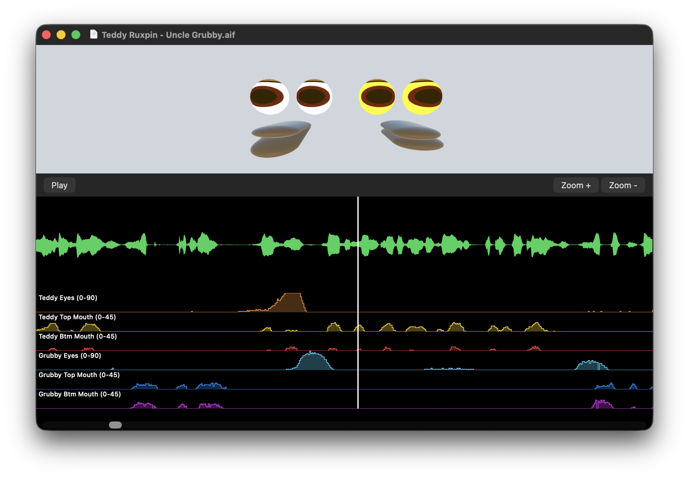

# Ruxpunk Story Editor

A macOS app that plays back Teddy Ruxpin audio cassette tapes and decodes the hidden animatronic control data embedded in the audio, visualizing it as a DAW-style timeline alongside a real-time 3D preview of the characters' faces.

## How It Works

Original Teddy Ruxpin cassette tapes are stereo recordings. The left channel contains the story audio (dialogue, music, sound effects), while the right channel carries an encoded control signal that drives the animatronic servos in the toy.

### Pulse-Distance Encoding

The control signal on the right channel uses a pulse-distance modulation scheme. The decoder processes the waveform sample-by-sample looking for negative-going pulses:

1. **Pulses** are detected as runs of negative samples. The distance (number of positive samples) between consecutive pulses encodes a servo position value.
2. **Frames** are delimited by long runs of negative samples (130+ consecutive negative samples signal a frame boundary).
3. Each frame contains up to 10 pulse distances. Specific indices map to specific servo channels:

| Pulse Index | Parameter | Input Range | Output Range |
|-------------|-----------|-------------|--------------|
| 2 | Teddy Eye Position | 42 - 62 | 0 - 90 degrees |
| 3 | Teddy Top Mouth | 50 - 73 | 0 - 45 degrees |
| 4 | Teddy Bottom Mouth | 45 - 65 | 0 - 45 degrees |
| 6 | Grubby Eye Position | 42 - 62 | 0 - 90 degrees |
| 7 | Grubby Top Mouth | 50 - 73 | 0 - 45 degrees |
| 8 | Grubby Bottom Mouth | 45 - 65 | 0 - 45 degrees |

The raw pulse distances are rescaled from their input ranges to rotation angles in degrees, then applied to a 3D SceneKit model of the characters' faces.

### Timeline Visualization

The app presents a scrollable, zoomable timeline with:

- **Audio waveform** (left channel) rendered with per-pixel peak computation using the Accelerate framework (vDSP)
- **Six parameter lanes** showing the decoded servo positions as step-function graphs
- **Playhead** with click-to-seek and drag-to-scrub
- **3D scene preview** driven from the decoded data, synchronized to the timeline position

All timeline rendering uses a viewport approach -- only the visible portion (~960 pixels) is rendered at any time, with lanes repositioned and re-rendered on scroll from cached data.

## Building

### Requirements

- Xcode 14+
- macOS 12.0+ deployment target

### Dependencies

- [AudioKit 5.6.x](https://github.com/AudioKit/AudioKit) (via Swift Package Manager)
- [AudioKitEX](https://github.com/AudioKit/AudioKitEX) (via Swift Package Manager)

### Steps

1. Clone the repository
2. Open `Ruxpunk Story Editor.xcodeproj` in Xcode
3. Xcode will automatically resolve the AudioKit SPM dependencies
4. Build and run (Cmd+R)

### Usage

1. Open a Teddy Ruxpin cassette audio file (.aif) via File > Open
2. The app decodes the right channel and displays the animation data in the timeline
3. Press Play or hit Space to start playback
4. Click or drag in the timeline to scrub to any position
5. Use Cmd+= / Cmd+- or pinch gestures to zoom the timeline
